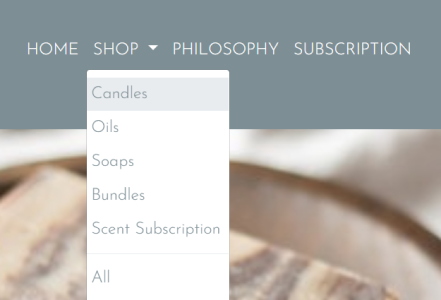
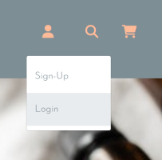
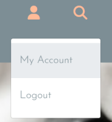
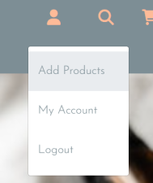
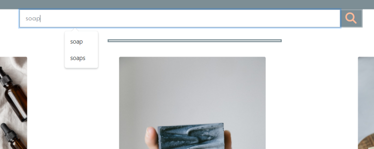
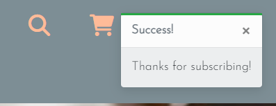

## Testing

 

### Functionality of Site

 
All functionality has been tested as outlined below:
 

#### Navigation

- The navigation remains fixed to the top the screen so users always have access to it. All images, and icons are displayed without error (Previous urls have been fixed as outlined in issues section of READme.md). Both the 'HOME' link and the website logo bring a user back to the homepage intuitively.
 

 
When 'SHOP' is clicked, a drop down menu appears and users can choose what product they wish to view. All of these links are working and bring the user to the products template where their selected product is rendered with a title and products laid out.
 
The account icon reflects a users signed-in state:
 
    1. Guest visitor - When guest visitors click the account icon, they are shown two options, <em>Sign-up</em> and <em>Log-in</em>
     
    
     
    2. Signed in User - When a user has already signed-up for an account and they have gone through the log-in process, the account icon shows them two options, <em>My Account</em> and <em>Log-out</em>
     
    
     
    3. Admin User - When an admin user is signed in there are 3 options from the account icon, <em>Add Products</em>, <em>My Account</em>, and <em>Log-out</em>. I have chosen to keep the 'My Account' option for admin in order to use it for testing orders,etc.
     
    
     
The search icon operates on desktop, and smaller screens responsively. When a user clicks the Font Awesome icon a search bar pops down where they can input keywords to search the database. If these words appear in a product name, or description, these products are displayed to the user
 

 
The shopping cart icons takes the user to the shopping cart page when clicked on all screen sizes.
 

#### Footer

The footer remains at the bottom of the screen on all screen sizes. It contains a newsletter input for users to sign-up to get news updates about new products/deals. This functions on all screen sizes, and the user receives a success message at the top of the homepage when they sign-up:
 

 

 
The social media icons function, and bring the user to the respective sites in a new window.
