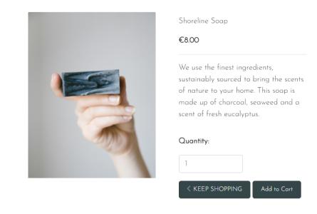

## Testing

 

## Functionality of Site

All functionality has been tested as outlined below:
 
 

### Navigation

- The navigation remains fixed to the top the screen so users always have access to it. All images, and icons are displayed without error (Previous urls have been fixed as outlined in issues section of READme.md). Both the 'HOME' link and the website logo bring a user back to the homepage intuitively.
 
 

 
When 'SHOP' is clicked, a drop down menu appears and users can choose what product they wish to view. All of these links are working and bring the user to the products template where their selected product is rendered with a title and products laid out.
 
The account icon reflects a users signed-in state:
 
    1. Guest visitor - When guest visitors click the account icon, they are shown two options, <em>Sign-up</em> and <em>Log-in</em>
     
    
     
    2. Signed in User - When a user has already signed-up for an account and they have gone through the log-in process, the account icon shows them two options, <em>My Account</em> and <em>Log-out</em>
     
    
     
    3. Admin User - When an admin user is signed in there are 3 options from the account icon, <em>Add Products</em>, <em>My Account</em>, and <em>Log-out</em>. I have chosen to keep the 'My Account' option for admin in order to use it for testing orders,etc.
     
    
     
     
The search icon operates on desktop, and smaller screens responsively. When a user clicks the Font Awesome icon a search bar pops down where they can input keywords to search the database. If these words appear in a product name, or description, these products are displayed to the user
 

 
The shopping cart icons takes the user to the shopping cart page when clicked on all screen sizes.
 

### Footer

The footer remains at the bottom of the screen on all screen sizes. It contains a newsletter input for users to sign-up to get news updates about new products/deals. This functions on all screen sizes, and the user receives a success message at the top of the homepage when they sign-up:
 

 

 
The social media icons function, and bring the user to the respective sites in a new window.
 

### Registration

When a user clicks on the sign-up button from the nav bar, they are brought to an AllAuth sign-up page which has inherited style from base.html. The form requires all fields be filled in, or there is an allauth warning shown to complete all fields. There is also an allauth warning if the passwords do not match, or the two email entries are not the same. 
 

 
Once a user fills in this information, they are taken to a page informing them that an email verification has been sent to their email address to verify their new account request. Their account page is automatically generated after this process.
 

 

### Log-in/Log-out

Users are able to log-in by clicking the account icon on the nav bar and selecting log-in. They are brought to an AllAuth page where they are asked to enter their username and password. They can also save their details by clicking a checkbox, or select 'Forgot Password' if they have forgotten theirs. 
 

 

 
 
When a user submits their sign-in information they are brought to the home page and a bootstrap success pop-up displays with their username.
 
The sign-out process follows a similar process, if the user clicks on log-out from the nav menu they are brought to a page where they will asked if they are sure they want to sign-out. Once they click this they are brought back to the home page and a bootstrap messages is displayed telling them they have signed out. The account menu options change after each action has been taken so users are always aware of their status.
 

### Home-page

The home page functions on all screen sizes. During testing there were issues with layout on smaller devices, but these have been resolved through media queries of both the carousel image display, and on the nav menu. Users can click through the different product categories to see what the shop has to offer.
 

 
At the time of testing the user could not interact anymore with the carousel, so I decided to insert anchor links on each product title, which when clicked would bring the user to the respective products page, e.g. 'Candles'. When the title is hovered over the font colour changes from dark green to white.
 
 

### Product Page

Whether a user clicks on a product category from the nav bar, clicks the home apge button 'Shop Now', or clicks on one of the category titles in the image carousel, they are brought to a page displaying their desired products. Whenever a category is clicked the product page code will filter out just the products that fit this category, as shown in the code block below:
 

 
For example, this is what a user sees when they click soaps, the title is displayed at the top of the page and the soap products are displayed, with responsiveness across all screen sizes
 

 
The product image, title and price is displayed and if a user clicks on the image they are then taken to the Product Detail Page.
 

### Product Detail Page

When a user clicks on a product the product opens up in the product detail page. This displays the product image, title, description, price, a selector to add quantity of the product, and add to cart button, and a keep shopping button if the users wants to go back to the products page.
 

 
 

##### Functionality

-The Keep Shopping button is functioning, and will bring users to the product page, where all products of the store are listed. 
- The add to cart button is functiion and will add the selected product and quantity to the shopping cart. The user sees a success message displayed:
 

 

### Shopping Cart Page

Users can get to the shopping cart page by clicking the shopping cart icon on the nav bar. Here they will see a display of the products they have added to their cart. The items are displayed in a simple bootstrap card. They are able to update the product quantity or click to remove the product from the cart if they have changed their mind.
 
The user is able to see the breakdown of the costs, with the sub-total, delivery and grand total listed. They are able to click on a button which takes them to the checkout page. 
 

 

### Checkout Page

The checkout page displays a form for the user to input their delivery/contact information. If a user is signed in they are able to save this delivery information which will be saved to their profile. If they are not signed in they are promopted to sign-up if they want to benefit from having an account, and quicker checkout in future.
 
I have used crispy forms to style the form, and the payment is processed through stripe. This functionality has been tested and is successful with the stripe practice card number (There were some formatting issues on the success page where the footer was floating which needs to be fixed with CSS.)
 

 

 
- Stripe built in error messages:
If a user fails to input a required field, gives an incorrectly formatted entry, or invalid card details error messages will pop up.

### User Profile

If a user is signed in they are able to access their account profile from the account icon on the navbar, and selecting 'My Account'. The profile page displays default delivery information on the left, and previous order information on the right. Displayed below is a test user, after successfully updating their default delivery information.
 

 
When I tested the past orders, the user is brought to an order history page the same as the end of the checkout process, and an info message is displayed stating it is a previous order : "This is a past confirmation for order number 8F2F335E6A574EFD84FB84BB10E6E8CA. A confirmation email was sent on the order date". I changed this from bootstrap toast info, to a bootstrap toast success message because the info message disappeared too quickly.
 

### Admin

The Admin can be accessed by adding 'admin' to the end of the webpage address. The admin section is Django's built in admin interface. I have tested out adding, editing, deleting categories and products here. I had a list of test orders which I have successfully removed from the database in the admin interface. I have also deleted test newsletter sign-up inputs, and test user profiles.

 

 

 

