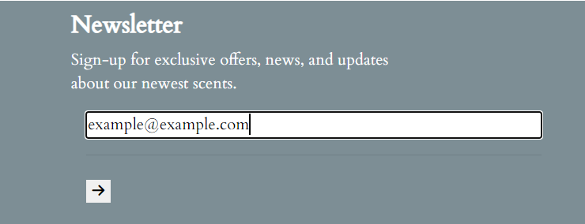

## Testing

 

### Functionality of Site

 
All functionality has been tested as outlined below:
 

#### Navigation

- The navigation remains fixed to the top the screen so users always have access to it. All images, and icons are displayed without error (Previous urls have been fixed as outlined in issues section of READme.md). Both the 'HOME' link and the website logo bring a user back to the homepage intuitively.
 

 
When 'SHOP' is clicked, a drop down menu appears and users can choose what product they wish to view. All of these links are working and bring the user to the products template where their selected product is rendered with a title and products laid out.
 
The account icon reflects a users signed-in state:
 
    1. Guest visitor - When guest visitors click the account icon, they are shown two options, <em>Sign-up</em> and <em>Log-in</em>
     
    
     
    2. Signed in User - When a user has already signed-up for an account and they have gone through the log-in process, the account icon shows them two options, <em>My Account</em> and <em>Log-out</em>
     
    
     
    3. Admin User - When an admin user is signed in there are 3 options from the account icon, <em>Add Products</em>, <em>My Account</em>, and <em>Log-out</em>. I have chosen to keep the 'My Account' option for admin in order to use it for testing orders,etc.
     
    
     
The search icon operates on desktop, and smaller screens responsively. When a user clicks the Font Awesome icon a search bar pops down where they can input keywords to search the database. If these words appear in a product name, or description, these products are displayed to the user
 

 
The shopping cart icons takes the user to the shopping cart page when clicked on all screen sizes.
 

#### Footer

The footer remains at the bottom of the screen on all screen sizes. It contains a newsletter input for users to sign-up to get news updates about new products/deals. This functions on all screen sizes, and the user receives a success message at the top of the homepage when they sign-up:
 

 

 
The social media icons function, and bring the user to the respective sites in a new window.
 

#### Registration

When a user clicks on the sign-up button from the nav bar, they are brought to an AllAuth sign-up page which has inherited style from base.html. The form requires all fields be filled in, or there is an allauth warning shown to complete all fields. There is also an allauth warning if the passwords do not match, or the two email entries are not the same. 
 

 
Once a user fills in this information, they are taken to a page informing them that an email verification has been sent to their email address to verify their new account request. Their account page is automatically generated after this process.
 

 

#### Log-in/Log-out

Users are able to log-in by clicking the account icon on the nav bar and selecting log-in. They are brought to an AllAuth page where they are asked to enter their username and password. They can also save their details by clicking a checkbox, or select 'Forgot Password' if they have forgotten theirs. 
 

 

When a user submits their sign-in information they are brought to the home page and a bootstrap success pop-up displays with their username.
 
The sign-out process follows a similar process, if the user clicks on log-out from the nav menu they are brought to a page where they will asked if they are sure they want to sign-out. Once they click this they are brought back to the home page and a bootstrap messages is displayed telling them they have signed out. The account menu options change after each action has been taken so users are always aware of their status.
 

#### Home-page

The home page functions on all screen sizes. During testing there were issues with layout on smaller devices, but these have been resolved through media queries of both the carousel image display, and on the nav menu. Users can click through the different product categories to see what the shop has to offer.
 

 
At the time of testing the user could not interact anymore with the carousel, so I decided to insert anchor links on each product title, which when clicked would bring the user to the respective products page, e.g. 'Candles'. When the title is hovered over the font colour changes from dark green to white.

