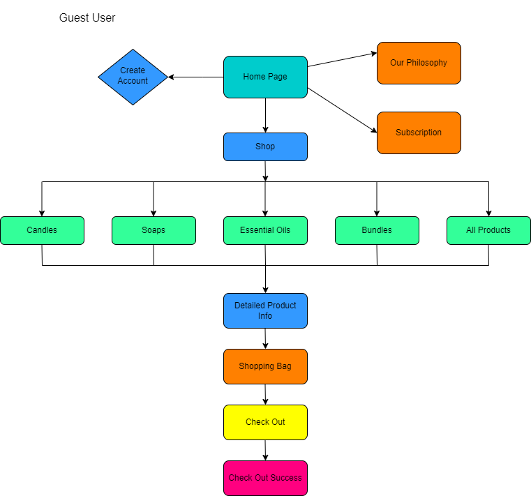
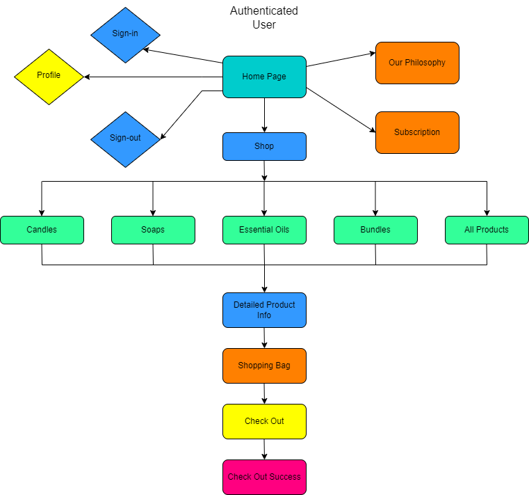
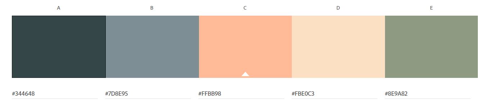
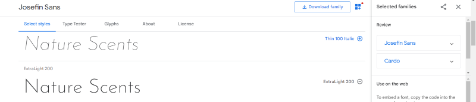
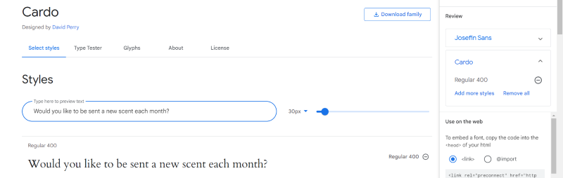

# Nature Scents
## Bring the aroma of nature into your home ✨

An e-commerce store with products that fill your home with the scents of the natural world, bringing calm, and brightening your day.

## User Experience(UX)

### Strategy Plane
Target Audience:

- People aged 16-55
- Users who like natural scents
- Users who want to improve their home space
- Users interested in health, nature and natural products
- Users who want to regularly receive new products through subscription 

The user can purchase <strong>one off items</strong> on the site, which makes the site useful to anyone who visits looking to purchase a product. The site also offers <strong>product combination bundles</strong> for users who want to try out a range of products, possibly buy as gifts etc. The final option for users is to purchase a <strong>yearly membership</strong> where they will be <strong>'sent a new scent'</strong> every month from the essential oils product section. This yearly subscription keeps the user engaged with the site, and may also lead to further purchases. 

This e-commerce sit is a B2C model. The goal of the site is to not only make one off sales but to encourage brand loyalty through subscription and a newsletter. The site uses minimal design, and a no frills up front approach to let the products speak for themselves.

### Strategy Roadmap

|                          Feature                                | Importance | Feasability |
| ---------------------------------------------------------------- | ------ | ----- |
| User can view a list of all products  | 5 | 5
| User can see a detailed view of selected product | 5 | 5
| User can add products to shopping bag and view bag | 5 | 5
| User Account Sign-up and Login | 5 | 5
| User Profile Page | 5 | 4
| User can edit their profile | 5 | 5
| User can delete their profile | 5 | 5
| User can recover a password | 5 | 5
| User can filter products by key word | 4 | 4
| User can purchase products using STRIPE payment | 5 | 5
| User can see reviews from other customers | 3 | 3
| Site owner can add products | 5 | 5
| Site owner can edit a product | 5 | 5
| Site owner can login to admin to edit products/approve users | 5 | 5

### User Stories
------
User stories have been organized into a Kanban style board here:

**Common user stories**:

- As a **user** I want to access the site on all screen sizes **so that I have** a seamless shopping experience
- As a **user** I want to easily understand the site navigation **so that I can** find what I need easily
- As a **user** I want to the site to have no broken links **so that I have** an uninterrupted experience

**Products**
- As a **user** I can filter products **so that I can** narrow down my search
- As a **user** I can view products **so that I can** add them to my shopping bag
- As a **user** I can view a detailed description of a product **so that I can** make a decision about purchasing it
- As a **user** I can select the quantity of a product **so that I can** add required amount to my order

**Basket**
- As a **user** I can add items to my shopping bag **so that I can** create a shopping bag of items to purchase
- As a **user** I can view my shopping bag **so that I can** review my purchase and add/edit as required
- As a **user** I can see a running total in my shopping bag **so that I can** see how much I am spending
- As a **user** I can process a payment **so that I can** pay for my order and receive confirmation

**User Account/Profile**
- As a **user** I am prompted to sign-up for an account **so that I can** benefit from having a profile and selecting a subscription
- As a **user** I can register for an account and login **so that I can** view my order information
- As a **user** I can see if I'm logged in or not **so that I can** login or logout
- As a **user** I can save my default shipping/billing details **so that I can** save time on my next visit
- As a **user** I can sign-up for for a scent subscription  **so that I can** receive new products each month

**Admin**
- As an **admin** I can login to Django administration **so that I can** access the site's backend
- As an **admin** I can add products to the site **so that I can** keep the site up to date and make products available to customers
- As an **admin** I can edit products/create sale items **so that I can** keep the site fresh and offer deals to customers
- As an **admin** I can make custom subscription products **so that I can** attract brand loyalty

**Marketing and SEO**

- As an **admin** I implement SEO keywords and meta tags **so that I can** attract customers and push my site up search engine listings
- As an **admin** I have created a Facebook Business Page **so that I can** increase my customer base
- As a **user** I can sign-up for a newsletter **so that I can** keep in the loop about new products/offers

## Scope Plane
-----------
In order to achieve the goals of the site owner and customer, the following features will be included in this release:

- Landing page with hero image 
- Responsive navbar that will navigate to the various pages throughout the site
- Shop page, that displays all products with the option to filter product category.
- Register/login feature using Django AllAuth so that users can create an account.
- Account page so logged in users can update their details
- Custom 404 error page

## Structure Plane
-----

**Site flow**

 
 

 
 

 

**Apps**
 

- Home App

- Checkout App

- Profile App

- Subscription App

- Shopping Cart App

## Skeleton Plane
----------

**Mobile View Wireframes**
 
 

 
 

 
 

 
 

 
 

 
 

 
 

 

**Desktop View Wireframes**
 
 

 
 

 
 

 
 

 
 

 
 

 
 

## Surface Plane
-------------

**Colour Scheme**
 
 

 
  
I have chosen this colour scheme as it is a combination or warm and calming tones which I feel matches the mood of the site, and the products on offer. The pink and orange contrast well with the darker blue and grey tones. 

**Fonts**
 
 

 
 
I chose Josefin Sans as the main font on the site, as it is simple and clean. I combined this with the Cardo font.
 
 

 
 

**Images**
 
 
All images were found on [Pexels](http://www.pexels.com/)