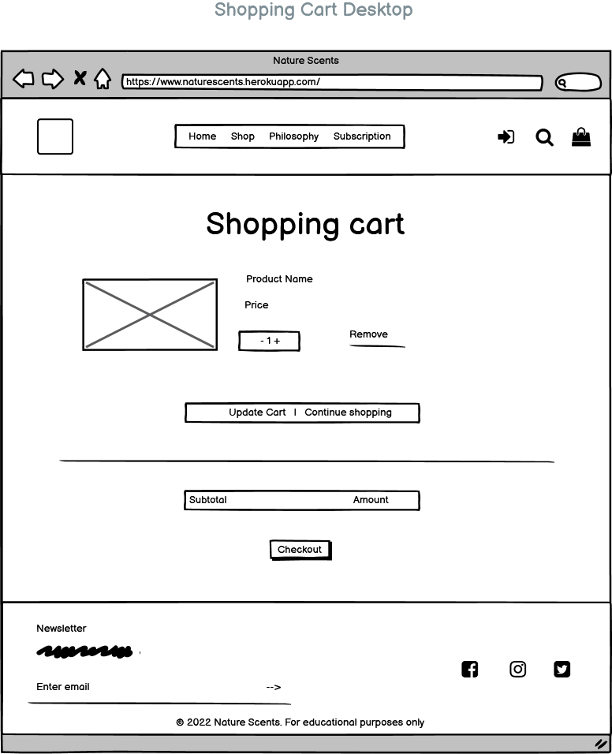
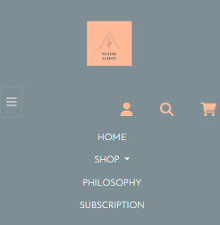
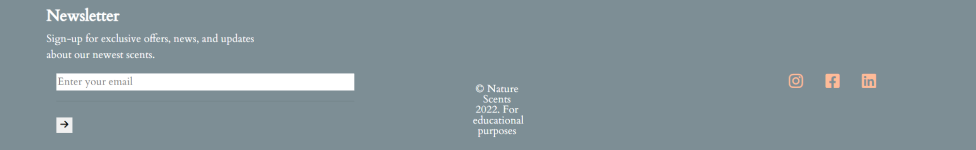
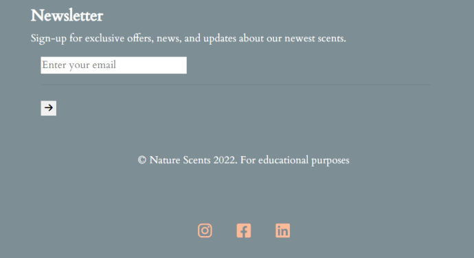
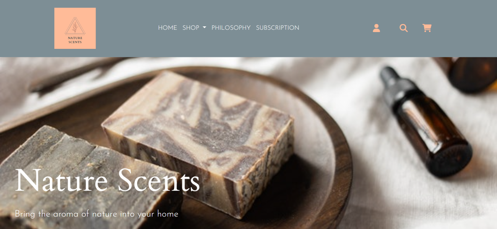
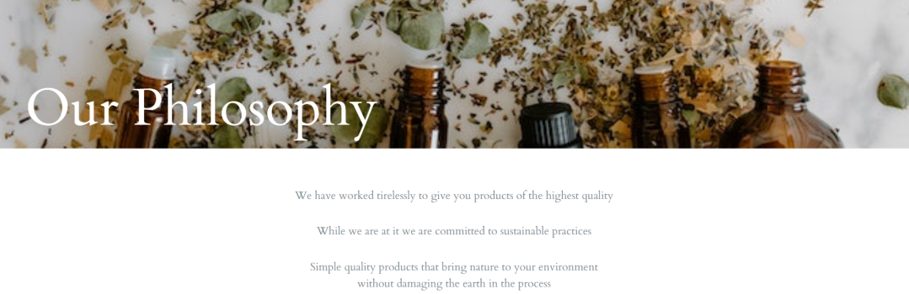
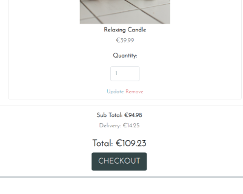

# Nature Scents
## Bring the aroma of nature into your home ✨
 

 
 

### A Full-stack Django-based E-commerce store with products that fill your home with the scents of the natural world, bringing calm, and brightening your day.
 
 

[]live link
 
 

## User Experience(UX)

### Strategy Plane
Target Audience:

- People aged 16-55
- Users who like natural scents
- Users who want to improve their home space
- Users interested in health, nature and natural products
- Users who want to regularly receive new products through subscription 

The user can purchase <strong>one off items</strong> on the site, which makes the site useful to anyone who visits looking to purchase a product. The site also offers <strong>product combination bundles</strong> for users who want to try out a range of products, possibly buy as gifts etc. The final option for users is to purchase a <strong>yearly membership</strong> where they will be <strong>'sent a new scent'</strong> every month from the essential oils product section. This yearly subscription keeps the user engaged with the site, and may also lead to further purchases. 

This e-commerce site is a B2C model. The goal of the site is to not only make one off sales but to encourage brand loyalty through subscription and a newsletter. The site uses minimal design, and a no frills up front approach to let the products speak for themselves.

### Strategy Roadmap

|                          Feature                                | Importance | Feasability |
| ---------------------------------------------------------------- | ------ | ----- |
| User can view a list of all products  | 5 | 5
| User can see a detailed view of selected product | 5 | 5
| User can add products to shopping bag and view bag | 5 | 5
| User Account Sign-up and Login | 5 | 5
| User Profile Page | 5 | 4
| User can edit their profile | 5 | 5
| User can delete their profile | 5 | 5
| User can recover a password | 5 | 5
| User can filter products by key word | 4 | 4
| User can purchase products using STRIPE payment | 5 | 5
| User can see reviews from other customers | 3 | 3
| User can see number of items in shopping bag with nav icon | 3 | 3
| Site owner can add products | 5 | 5
| Site owner can edit a product | 5 | 5
| Site owner can login to admin to edit products/approve users | 5 | 5

### User Stories
------

**Common user stories**:

- As a **user** I want to access the site on all screen sizes **so that I have** a seamless shopping experience
- As a **user** I want to easily understand the site navigation **so that I can** find what I need easily
- As a **user** I want to the site to have no broken links **so that I have** an uninterrupted experience

**Products**
- As a **user** I can filter products **so that I can** narrow down my search
- As a **user** I can view products **so that I can** add them to my shopping bag
- As a **user** I can view a detailed description of a product **so that I can** make a decision about purchasing it
- As a **user** I can select the quantity of a product **so that I can** add required amount to my order

**Basket**
- As a **user** I can add items to my shopping bag **so that I can** create a shopping bag of items to purchase
- As a **user** I can view my shopping bag **so that I can** review my purchase and add/edit as required
- As a **user** I can see a running total in my shopping bag **so that I can** see how much I am spending
- As a **user** I can process a payment **so that I can** pay for my order and receive confirmation

**User Account/Profile**
- As a **user** I am prompted to sign-up for an account **so that I can** benefit from having a profile and selecting a subscription
- As a **user** I can register for an account and login **so that I can** view my order information
- As a **user** I can see if I'm logged in or not **so that I can** login or logout
- As a **user** I can save my default shipping/billing details **so that I can** save time on my next visit
- As a **user** I can sign-up for for a scent subscription  **so that I can** receive new products each month

**Admin**
- As an **admin** I can login to Django administration **so that I can** access the site's backend
- As an **admin** I can add products to the site **so that I can** keep the site up to date and make products available to customers
- As an **admin** I can edit products/create sale items **so that I can** keep the site fresh and offer deals to customers
- As an **admin** I can make custom subscription products **so that I can** attract brand loyalty

**Marketing and SEO**

- As an **admin** I implement SEO keywords and meta tags **so that I can** attract customers and push my site up search engine listings
- As an **admin** I have created a Facebook Business Page **so that I can** increase my customer base
- As a **user** I can sign-up for a newsletter **so that I can** keep in the loop about new products/offers

## Scope Plane
-----------
In order to achieve the goals of the site owner and customer, the following features will be included in this release:

- Landing page with hero image 
- Responsive navbar that will navigate to the various pages throughout the site
- Shop page, that displays all products with the option to filter product category.
- Register/login feature using Django AllAuth so that users can create an account.
- Account page so logged in users can update their details, and see previous orders
- Custom 404 error page

## Structure Plane
-----

**Site flow**

 
 

 
 

 

**Apps**
 

- Home App

 
The Home App contains the templates for the home page, subscription page and philosophy page. It is a simple app that exists with views, and urls to render these pages on the website.
 

- Products App

 
The Products App is the main hub of the site, where all users are drawn in order to view products, see them in detail and add them to their shopping cart. The app contains two models: The <strong>Product</strong> model and the <strong>Category</strong>
model. There is a product detail view linked to a product detail template so that users can clic into an individual product and see further details about it, and if they decide add it to their shopping cart.
 
Site owners have the ability to add products to the database from the frontend using the add_product view, they can also edit or delete poroducts from the database, using the edit_product, and delete_product views respectively.
 

- Shopping Cart App

 
The Shopping Cart App has 4 views, cart, add_to_cart, adjust_cart and remove_from_cart. The cart view renders the contents of the users shopping cart into the cart template. The other 3 views allow the user to either add to their cart, adjust the quantity of the product in question or if they change their mind they can remove products from their cart..
 

- Checkout App

 
The Checkout App consist of two models, Order and OrderLineItem. This app's function is to take what is in the users shoppign cart and enable them to go through the process of payment and order completion.
 
The Order Line Item model has a Foriegn Key to product, and order. It captures the product, quantity and price of the items in the users shopping cart.
 
The Order model contains all the users' shipping/billing details, contact details etc. It has a Foreign Key to the User_Profile model, and captures the total cost of the order, also calculating if the customer has hit the free delivery threshold of €50. It also contains information regarding the payment, the stripe PID and has an original cart field to be sent to the admin.
 

- Profile App

 
The Profile App allows authenticated users to see 2 things about their account. Firstly they are able to see their default address/contact details for orders, using a Form called UserProfileForm. When they are logged in ans go to checkout their default information prepopulates the checkout form which makes for a better user experience. The second thing they are able to access from this app is a run down of their order history, with unique id that is generated from the checkout app. It contains one model, UserProfile.
 

- Newsletter App

 
The Newsletter App has one model NewsletterInput, with an email field. This app links to a frontend input positioned in the footer of the site, which enables users to enter their email to sign-up for news updates, special offers etc.

## Skeleton Plane
----------

**Mobile View Wireframes**
 
 

 
 

 
 

 
 

 
 

 
 

 
 

 

**Desktop View Wireframes**
 
 

 
 

 
 

 
 

 
 

 
 

 
 

## Surface Plane
-------------

**Colour Scheme**
 
 

 
  
I have chosen this colour scheme as it is a combination or warm and calming tones which I feel matches the mood of the site, and the products on offer. The pink and orange contrast well with the darker blue and grey tones. 

**Fonts**
 
 

 
 
I chose Josefin Sans as the main font on the site, as it is simple and clean. I combined this with the Cardo font.
 
 

 
 

**Images**
 
 
All images were found on [Pexels](http://www.pexels.com/)
 
 
Sources are as follows:
 
Photos by Meruyert Gonullu

Photos by Tara Winstead

Photos by MART PRODUCTION

Photoss by Monstera from Pexels 

Photos by Alesia Kozik from Pexels

Photos by EKATERINA BOLOVTSOVA from Pexels

Photo by Dominika Roseclay from Pexels

## Project Planning/Agile
 
I have utilised Github's projects section to create a project board with issues in the planning and implementation of the project.

The project board can be found [here] (https://github.com/users/kreilly86/projects/4)
 

## Features

### Existing Features
 

 ### Navigation

 
<strong>Main navigation</strong>
 
 

 
The main navigation is fixed to the top of the page, with a simple logo, a menu, and three icons which link to account functionality, a search bar and the shopping cart. The shop title on the menu bar is a drop down where the user can select what product category to open and browse.
 
 
<strong>Mobile navigation</strong>
 
The mobile navigation containers a burger style menu, which drops down on the left side. 
 

 
When the dropdown menu is clicked, the content is centered and easy to access.
 

 
 

### Footer

 
<strong>Desktop Footer</strong>
 
The footer is simple, with a white background and is divided from the main content with a horizontal bar. It contains a newsletter sign-up input, copyright information and social media icon links
 

 
<strong>Mobile/Tablet Footer</strong>
 

The footer contents stack on mobile and tablet view:
 

 
<strong>Home Page</strong>
 

The home page contains a hero image with natural products and an H1 title with bootstrap class 'display-4'. It is follwed by a lead description expplaining to the user what the site is about, "Bring the aroma of nature into your home".
 

 

The bottom half of the home page contains a 'Shop' button to take users to the products page and below a bootstrap carousel of images showing the different category of productd available.

 

 

<strong>Philosophy Page</strong>
 
The Philosophy page is simple, with a short description of the company's ethos. It contains a striking image and bold title in white
 

 

<strong>Subscription Page</strong>
 
The subscription page is similar to the Philosophy page in that is has a striking ikage and cold title in white. Below is a deacription of the yearly membership, which provides users with a monthly delivery of new 'scents' to their door. I have use a zoom effect on the images inspired by the Code Institute Love running club project effect. This brings a bit of life to the page. Users can then click on the more info button and the subscription product is displayed in the product detail template. From there they can add the product to their shopping cart.
 

 

 

<strong>Products Page</strong>
 
Users can access the products page from the main nav bar by clicking 'Shop' and selecting a type of products, or 'all products'. This will filter the products into sections, with the all selection showing the titles of all the categories at the top of the page.
 

 

 

 

<strong>Product Detail</strong>
 
When a user clicks on one of the products they are taken to the product detail page. This displays an image of the product, a description, the price, a quantity selector, and an add to cart button. Once the user clicks on add to cart they see a bootstrap success message pop up. Otherwise they can can click on keep shopping to be taken back to the products page, which shows all products.
 

 

 

<strong>Cart Page</strong>
 
The cart page displays all items the user has addedd, displayed stacked in a bootstrap col-12 div. The user can click to delete the item from the cart, or edit the quantity. The total price is displayed including delivery, which is free over €50. The checkout button brings the user to the final step in the process.
 

 

<strong>Checkout Page</strong>
 
The checkout page contains a simple form, with address details, and a card input box made using Stripe. Once the users enters all information they are given a warning of how much they will be charged before proceeding. There is also a checkbox if logged in users would like to save their address details for future purchases. When the payment is processed the user is shown a success pop up, and message thanking them for their order.
 

 
 

 
 

 

### Future Features
 
 

 
 
The user is currently able to browse products and add them to their shopping cart. They are then able to click through to the checkout page but this remains incomplete. I also need to make a profile page for users. 
 
 
The subscrition app is incomplete. Further information needs to be added, and a payment option to charge a yearly one off fee in return for a monthly delivery of custom products for the user.
 
 
The newsletter sign-up contained in the footer is not functioning yet.

## Marketing and SEO
 
 

I have created a (Facebook business page)[https://www.facebook.com/nature.scents.irl]
 
 

 
Keywords have been used in meta tags based in the base.html file. I have kept the site simple, and didn't overcomplicate this process with lengthy descriptions.
 
 

## Issues
 
 
The Django Secret_Key was accidentally pushed to git hub, this has been changed and secured in an env.py file. 
 
 

### Issue with Stripe Credit card input box when deployed to Heroku

 
During testing I came up across an issue with the checkout page, specifically the credit/debit card input box. When running locally it was showing up as expected, but on Heroku it was a blank input with no way to input card details. I had various stages of trying to resolve this issue:
 

## Testing
 
 
App Checkout:

 
As I had not implemented a free delivery threshold, the postage charges generated were quite excessive. e.g. €14. I changed this by creating a free delivery threshold of €50
 

 

### Code Validation
 
 
- W3C Mark-up Validation
- W3C CSS Validtion
- Lighthouse
- 

## Credits 
 
 
Code and structure for this e-commerce site has largely come from Code Institute's Boutique Ado walkthrough project: 
 
https://github.com/Code-Institute-Solutions/boutique_ado_v1/tree/9ed36dc2c07228041b56b28174dd96ee56e6c59a
 

